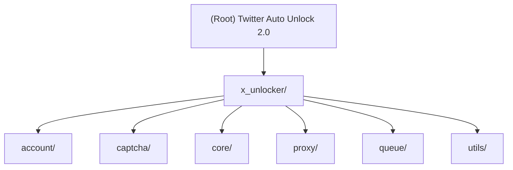

# 技术参考文档

> **Generated**: 2026-01-19 | **Version**: 2.0.0 | **Language**: Python 3.10+

---

## Project Vision

Twitter 自动解锁工具 2.0 是一个 CLI 批量处理工具，用于自动解锁被限制的 Twitter/X 账号。核心功能包括：

- **批量账号解锁**：支持并发 3-10 个浏览器实例
- **双重验证码处理**：Cloudflare Turnstile + Arkose FunCaptcha
- **自动登录 + 2FA**：TOTP 验证码自动生成与输入
- **Cookie 导出**：解锁后自动保存会话数据

---

## Twitter 解锁完整流程

> **重要**：此流程文档描述了 Twitter 账号解锁的完整步骤和风控点。

### 流程概览

| 步骤 | 阶段 | 说明 | 风控点 | 处理模块 |
|------|------|------|--------|----------|
| 1 | **访问登录页** | 打开 x.com 登录页面 | - | `core/bitbrowser_provider.py` |
| 2 | **输入账号** | 输入用户名/邮箱 | **强风控点** | `account/auth.py` |
| 2a | ↳ 风控拦截 | 检测到自动化行为 | 无法继续操作，直接失败 | - |
| 2b | ↳ 身份验证 | 要求填写邮箱/手机号 | 需正确填写后继续 | `account/unusual_activity.py` |
| 3 | **输入密码** | 正常密码输入 | - | `account/auth.py` |
| 4 | **2FA 验证** | TOTP 验证码 | - | `account/auth.py` |
| 5 | **Cloudflare 验证** | Turnstile 验证码 | **YesCaptcha 人机助手自动处理** | `unlock_flow.py` |
| 6 | **FunCaptcha 验证** | Arkose FunCaptcha | **YesCaptcha 人机助手自动处理** | `unlock_flow.py` |
| 7 | **完成解锁** | 账号恢复正常状态 | - | `core/session.py` |

### 关键风控点说明

1. **步骤 2 - 账号输入阶段**
   - 这是 Twitter 风控最严格的环节
   - 会检测浏览器指纹、自动化行为、鼠标轨迹等
   - **风控结果 A**：直接拦截，无法进行任何操作（失败）
   - **风控结果 B**：要求填写邮箱/手机号验证身份
   - **处理模块**: `account/unusual_activity.py`

2. **步骤 5 - Cloudflare Turnstile**
   - 2FA 验证通过后的第一道验证码
   - **YesCaptcha 人机助手插件自动处理**
   - 代码等待验证码 iframe 消失即可
   - **处理模块**: `unlock_flow.py`

3. **步骤 6 - Arkose FunCaptcha**
   - 解锁页面 (`/account/access`) 的验证码
   - **YesCaptcha 人机助手插件自动处理**
   - 代码等待验证码 iframe 消失即可
   - **处理模块**: `unlock_flow.py`

### 异常活动验证（Unusual Activity）

当 Twitter 检测到可疑行为时，会要求用户验证身份：

- **触发条件**: 自动化检测、IP 异常、设备指纹异常
- **验证方式**: 要求输入邮箱地址/用户名/手机号
- **页面特征**:
  - 标题: "Verify your identity"
  - 说明: "Enter your email address to verify that it's you"
- **处理模块**: `account/unusual_activity.py`

### 状态机流程图

```
┌─────────────────────────────────────────────────────────────────┐
│                                                                 │
│  INIT                                                           │
│    │                                                            │
│    ▼                                                            │
│  LOGGING_IN                                                     │
│    │                                                            │
│    ├─► [风控拦截?] ──Yes──► FAILED (无法继续)                   │
│    │                                                            │
│    ├─► [身份验证?] ──Yes──► UNUSUAL_ACTIVITY                   │
│    │         │                      │                          │
│    │        No                      ▼                          │
│    │         │              填写邮箱/手机号                      │
│    │         │                      │                          │
│    │         ◄──────────────────────┘                          │
│    │                                                            │
│    ▼                                                            │
│  ENTERING_PASSWORD ──► VERIFYING_2FA                           │
│                              │                                  │
│                              ▼                                  │
│                    WAITING_CLOUDFLARE (Turnstile)              │
│                              │                                  │
│                              ▼                                  │
│                    等待 YesCaptcha 人机助手处理                  │
│                              │                                  │
│                              ▼                                  │
│                    WAITING_FUNCAPTCHA (Arkose)                 │
│                              │                                  │
│                              ▼                                  │
│                    等待 YesCaptcha 人机助手处理                  │
│                              │                                  │
│                              ▼                                  │
│                          VERIFYING                              │
│                              │                                  │
│    ├─► [成功?] ──Yes──► SUCCESS ──► SAVING (导出 cookies)      │
│    │                                                            │
│    └─► [失败?] ──Yes──► FAILED                                 │
│                                                                 │
└─────────────────────────────────────────────────────────────────┘
```

---

## Architecture Overview

```
+------------------+     +-------------------+     +------------------+
|    main.py       | --> |  queue/worker.py  | --> | core/unlock_flow |
|   (CLI Entry)    |     | (Concurrency Mgr) |     |  (State Machine) |
+------------------+     +-------------------+     +------------------+
                                  |                        |
                    +-------------+-------------+          |
                    |             |             |          |
              +-----v----+  +-----v-----+ +-----v-----+    |
              |BitBrowser|  | session   | | account/  |    |
              | provider |  | manager   | | auth.py   |<---+
              +----------+  +-----------+ +-----------+
                    |
              +-----v----------------------------------+
              |         验证码处理 (统一)                |
              |  检测 iframe → 等待 YesCaptcha 插件处理  |
              +----------------------------------------+
                              |
                    +---------v---------+
                    | YesCaptcha 人机助手 |
                    |   (浏览器插件)      |
                    +-------------------+
```

---

## Module Structure (Mermaid)



---

## Module Index

| Module | Path | Description | Entry Files |
|--------|------|-------------|-------------|
| **account** | `x_unlocker/account/` | 账号解析与 Twitter 登录认证 | `parser.py`, `auth.py` |
| **captcha** | `x_unlocker/captcha/` | 验证码检测（YesCaptcha 人机助手自动处理） | `factory.py` |
| **core** | `x_unlocker/core/` | BitBrowser 管理与解锁状态机 | `bitbrowser_provider.py`, `unlock_flow.py`, `session.py` |
| **proxy** | `x_unlocker/proxy/` | SOCKS5 代理解析与转发 | `parser.py`, `forwarder.py` |
| **queue** | `x_unlocker/queue/` | 并发任务调度 | `worker.py` |
| **utils** | `x_unlocker/utils/` | 日志与工具函数 | `logger.py` |

---

## Running & Development

### Installation

```bash
pip install -r requirements.txt
```

### YesCaptcha 人机助手安装（推荐）

YesCaptcha 人机助手是一个浏览器插件，可以自动识别和点击验证码（包括 reCaptcha、hCaptcha、FunCaptcha 等）。

**比特浏览器安装方式：**

1. **应用商店安装（推荐）**：
   - 打开比特浏览器 → 扩展中心 → 添加自定义扩展 → 添加Chrome商店扩展
   - 输入扩展详情URL：`https://chromewebstore.google.com/detail/yescaptcha-assistant/jiofmdifioeejeilfkpegipdjiopiekl`
   - 点击确定

2. **安装包安装**：
   - 下载插件包：`google_pro_1.3.2.zip`
   - 解压到本地目录
   - 比特浏览器 → 扩展中心 → 加载已解压的扩展程序 → 选择解压目录

**配置插件**：
- 安装后点击插件图标
- 输入 YesCaptcha API Key
- 启用自动识别

**文档链接**：
- 安装教程：https://yescaptcha.atlassian.net/wiki/spaces/YESCAPTCHA/pages/491749377
- 人机助手：https://yescaptcha.atlassian.net/wiki/spaces/YESCAPTCHA/pages/25722881/YesCaptcha

### Dependencies

| Package | Version | Purpose |
|---------|---------|---------|
| playwright | >=1.40.0 | Browser automation (CDP) |
| aiohttp | >=3.9.0 | Async HTTP client (YesCaptcha API) |
| pyotp | >=2.9.0 | TOTP 2FA code generation |
| aiofiles | >=23.2.1 | Async file operations |
| pyyaml | >=6.0.1 | Config file parsing |

### Basic Usage

```bash
# Using config file
python main.py --input accounts.txt --config config.yaml

# With options
python main.py --input accounts.txt --config config.yaml --concurrency 5
```

### CLI Arguments

| Argument | Default | Description |
|----------|---------|-------------|
| `--input, -i` | Required | 账号文件路径 |
| `--config, -c` | None | 配置文件路径 (YAML) |
| `--output, -o` | `./output` | 输出目录 |
| `--concurrency` | 5 | 最大并发数 |
| `--max-attempts` | 3 | 每账号最大重试次数 |
| `--debug` | False | 调试日志 |

### Account File Format

```
# Format 1: username:password:email:2fa (4 fields, @ in 3rd = email)
hugo_hughes_:password123:hugo@email.com:TOTP_SECRET

# Format 2: username:password:2fa (3 fields)
hugo_hughes_:password123:TOTP_SECRET

# Format 3: Full format (8 fields)
username:password:2fa:token:email:email_pass:email_client_id:email_token
```

---

## Coding Standards

### Python Style

- **Version**: Python 3.10+
- **Async**: 全异步架构，使用 `asyncio`
- **Type Hints**: 所有函数签名需类型注解
- **Docstrings**: 模块/类/函数需中英文文档字符串
- **Logging**: 使用 `x_unlocker.utils.logger.get_logger()`

### Error Handling

```python
# Custom exceptions per module
class CaptchaSolverError(Exception): ...
class AccountParseError(Exception): ...
class ProxyParseError(Exception): ...

# Always log errors before raising
logger.error(f"描述: {error}")
raise CustomError(f"描述: {error}")
```

### Naming Conventions

| Type | Convention | Example |
|------|------------|---------|
| Module | snake_case | `unlock_flow.py` |
| Class | PascalCase | `BitBrowserProvider` |
| Function | snake_case | `parse_accounts_file()` |
| Constant | UPPER_SNAKE | `HUMAN_DELAY_MIN` |
| Private | _prefix | `_setup_request_interceptor()` |

---

## Project Structure

```
twitter-auto-unlocker2.0/
├── CLAUDE.md               # 项目宪法（精简版）
├── README.md               # 项目说明（面向人类）
├── config.yaml             # 配置文件
├── accounts.txt            # 账号列表文件
├── requirements.txt        # 依赖
├── main.py                 # CLI 入口
├── docs/                   # 文档目录
│   ├── plan.md             # 任务计划
│   ├── TECH_REFERENCE.md   # 本文件
│   └── AI_GUIDE.md         # AI 使用指南
├── memory-bank/            # 上下文记忆
│   ├── activeContext.md
│   ├── productContext.md
│   ├── techContext.md
│   └── progress.md
├── x_unlocker/             # 源代码目录
│   ├── core/               # 核心模块
│   │   ├── browser.py
│   │   ├── browser_factory.py
│   │   ├── bitbrowser_provider.py
│   │   ├── bitbrowser_client.py
│   │   ├── unlock_flow.py
│   │   └── session.py
│   ├── captcha/            # 验证码处理
│   │   ├── factory.py
│   │   └── base.py
│   ├── account/            # 账号处理
│   │   ├── parser.py
│   │   └── auth.py
│   ├── proxy/              # 代理处理
│   │   └── parser.py
│   ├── queue/              # 任务队列
│   │   └── worker.py
│   └── utils/              # 工具
│       └── logger.py
└── output/                 # 输出目录
    └── {account}/
        ├── cookies.json
        └── screenshot_*.png
```

---

## Version History

| Version | Date | Changes |
|---------|------|---------|
| 2.0.0 | 2026-01-19 | 重构：BitBrowser + YesCaptcha 人机助手 |
| 1.x.x | 2026-01-18 | 旧版本：Camoufox + 2captcha/CapMonster/FunBypass |
